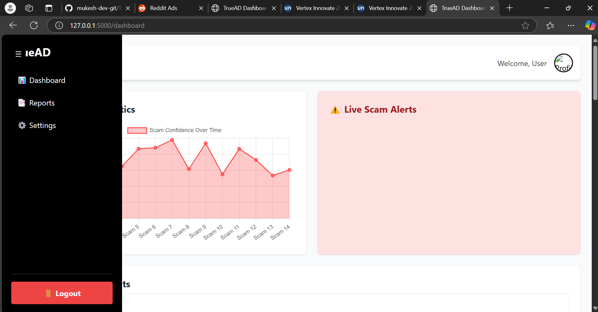
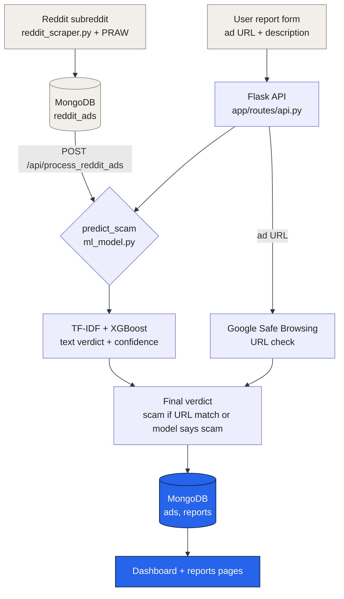

<div align="center">


<a href="#-detection-pipeline"></a>

<br/>

[](https://www.python.org)
[](https://flask.palletsprojects.com)
[](https://flask-socketio.readthedocs.io)
[](https://www.mongodb.com)
[](https://xgboost.readthedocs.io)
[](https://scikit-learn.org)
[](https://praw.readthedocs.io)
[](https://tailwindcss.com)
[](https://www.chartjs.org)
<br/>
[](#-status-and-known-limitations)
[](LICENSE)

</div>

---

##  Project Overview

TrueAD classifies advertisement text as **scam or safe**. It has a Flask backend with a JSON API, a MongoDB store, a **TF-IDF + XGBoost** text classifier trained on a spam/ham dataset, an optional **Google Safe Browsing** URL check, optional **EasyOCR** text extraction from images, and a small dashboard with charts and a report portal. A separate script pulls candidate ads from a subreddit through the Reddit API so they can be scored in bulk.

It was built in February 2025 and last updated in April 2025. The text-classification path and the dashboard work; several things in the original plan were never connected, listed in [Status and known limitations](#-status-and-known-limitations).

### Key Features

-  **Text classifier**: TF-IDF (5,000 features) into an XGBoost model, trained by `train_xgboost.py` on `spam_vs_ham.csv` (80/20 split).
-  **URL check**: submitted ad URLs are checked against the Google Safe Browsing API and force a scam verdict on a match.
-  **Report portal**: users submit an ad URL and description; each report gets a verdict and a confidence value.
-  **Dashboard**: overall statistics, paginated and searchable reports, and settings pages.
-  **Reddit ingestion**: `reddit_scraper.py` stores recent subreddit posts, and `/api/process_reddit_ads` scores them.

##  Screenshots

| Dashboard | Reports | Overview |
|---|---|---|
|  |  |  |

More captures and a demo video are in [`Screenshots_video/`](Screenshots_video/).

##  Detection Pipeline



##  Requirements

- Python 3.8+
- MongoDB running locally (or a connection string in `MONGO_URI`)
- Optional: a Google Safe Browsing API key, and a Reddit script app for the scraper
- Internet access on first run to download the EasyOCR models, and for the Tailwind and Chart.js CDNs used by the pages

##  Quick Start

### Installation

```bash
git clone https://github.com/mukesh-dev-git/TrueAD-1.0.git
cd TrueAD-1.0

python -m venv venv
source venv/bin/activate  # On Windows: venv\Scripts\activate

pip install -r requirements.txt
```

### Configuration

`config.py` is gitignored. Copy the template and fill in what you need:

```bash
cp config.example.py config.py
```

| Setting | Used by | Required |
|---|---|---|
| `SECRET_KEY` | Flask | Yes (change it) |
| `MONGO_URI` | database and scraper | Yes (defaults to local MongoDB) |
| `GOOGLE_SAFE_BROWSING_API_KEY` | URL check in `/api/submit_report` | Only for URL reports |
| `REDDIT_CLIENT_ID`, `REDDIT_CLIENT_SECRET`, `REDDIT_USERNAME`, `REDDIT_PASSWORD`, `REDDIT_USER_AGENT` | `reddit_scraper.py` | Only for the scraper |

Set them as environment variables, or edit `config.py` locally. Never commit real keys or passwords.

### Run

```bash
python main.py                 # dashboard and API at http://localhost:5000
python reddit_scraper.py       # optional: pull recent posts from a subreddit into MongoDB
```

### Retrain the model (optional)

The trained model and vectorizer are committed in `models/`. To rebuild them:

```bash
python train_xgboost.py        # reads spam_vs_ham.csv, writes models/xgboost_model.pkl and tfidf_vectorizer.pkl
```

##  API

| Method | Endpoint | Purpose |
|---|---|---|
| POST | `/api/detect_scam` | JSON `{"text": "..."}` returns verdict and confidence, and stores the ad |
| POST | `/api/submit_report` | Form with `ad_url`, `description`, optional `proof_images` creates a report |
| GET | `/api/get_reported_ads` | Paginated reports, with `page`, `per_page` and `search` |
| GET | `/api/get_reports` | Paginated scored ads |
| GET | `/api/get_overall_statistics` | Scam/safe counts and average confidence |
| POST | `/api/process_reddit_ads` | Score everything in `reddit_ads` |

Pages: `/` and `/dashboard`, `/reports`, `/settings`.

##  Project Structure

```
TrueAD-1.0/
├── main.py                  # Flask + Socket.IO app, page routes
├── config.example.py        # settings template (copy to config.py)
├── app/
│   ├── extensions.py        # Socket.IO instance
│   ├── routes/              # api.py (registered), ml_model.py, alerts.py, scraper.py
│   ├── templates/           # dashboard, reports, settings, layout
│   └── static/              # scripts.js, styles.css
├── models/                  # database.py, xgboost_model.pkl, tfidf_vectorizer.pkl
├── reddit_scraper.py        # Reddit ingestion script
├── train_xgboost.py         # model training
├── del_scam.py              # clears the ads collection
├── spam_vs_ham.csv          # training data
└── Screenshots_video/
```

##  Status and Known Limitations

This is a prototype. What is and is not in place:

| Area | State |
|---|---|
| Text classification (`/api/detect_scam`) | Working |
| Report submission with URL check | Working when a Safe Browsing key is set |
| Dashboard, reports and statistics pages | Working |
| Reddit ingestion and bulk scoring | Working when Reddit credentials are set |
| Image proof upload | Files are accepted but not processed; the OCR helper is never called from the report route |
| Real-time alerts (Socket.IO) | The server is initialised, but the alert route is written and never registered, so no alerts are sent |
| `ml_model.py` and `scraper.py` routes | Written but not registered in `main.py` |
| User accounts | A `users` collection and index exist; there is no login |
| Facebook, Twitter and Instagram scraping | Not implemented (only Reddit) |
| Confidence value | The highest class probability, so for a "safe" verdict it is confidence in "safe", not a scam probability |
| Tests and deployment | Not implemented |

### External services

| Service | Used for | Needed to run? |
|---|---|---|
| MongoDB (local) | Ads, reports, Reddit posts | Yes |
| Google Safe Browsing API | URL checks | Only for URL reports |
| Reddit API (script app) | Scraper | Only for the scraper |
| EasyOCR model download | OCR helper | Yes, on first import |
| Tailwind and Chart.js CDNs | Frontend styling and charts | Yes, for the pages to render |

##  Ideas for Next Steps

- Register the alerts, scraper and ML blueprints, and call the OCR helper for uploaded proof images
- Return a real scam probability instead of the top class probability
- Add authentication and persist the settings page
- Add tests and a reproducible environment

##  License

MIT. See [LICENSE](LICENSE).

<div align="center">


</div>
